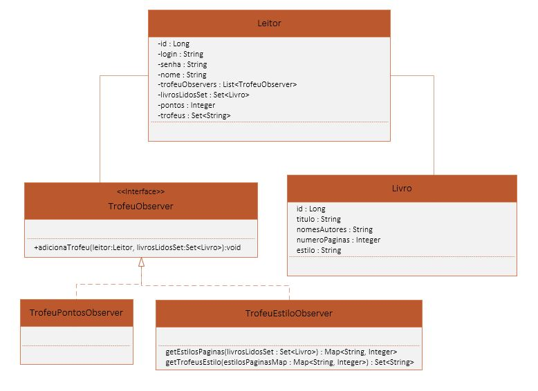

# Sistema: "Esse eu já li"
Trabalho do curso Princípios de Desenvolvimento Ágil de Software oferecido pelo ITA através do Coursera.

Aplicação feita utilizando Spring MVC, banco de dados H2, e Thymeleaf.

## Funcionalidades implementadas

- Logar usuário
- Visualizar lista de livros
- Visualizar livro
- Marcar leitura de livro
- Visualizar ranking de usuários
- Visualizar pontos e troféus de usuário

## Diagrama de classes de análise

